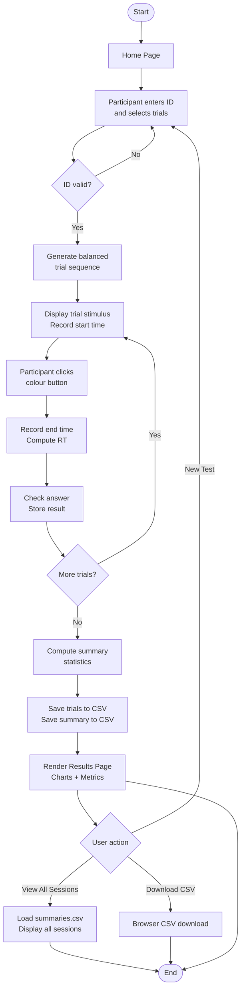

# PROJECT REPORT

# Cognitive Attention and Reaction Time Analyzer Using Python

---

## Title Page

```
Project Title  : Cognitive Attention and Reaction Time Analyzer Using Python
Subject        : Mini Project (Cognitive Science / AI & Data Science)
Student Name   : [ENTER YOUR NAME]
Register Number: [ENTER YOUR REGISTER NUMBER]
Department     : Artificial Intelligence and Data Science
College        : [ENTER YOUR COLLEGE NAME]
Guide          : [ENTER GUIDE NAME], [Designation]
Academic Year  : 2024 – 2025
Semester       : [VI / V]
```

---

## Abstract

This mini project implements an interactive, browser-based Stroop Colour-Word Test
to study selective attention, cognitive interference, and human reaction time.
The Stroop test, first described by John Ridley Stroop in 1935, exploits the conflict
between two automatic cognitive processes — word reading and colour naming — to produce
measurable interference in response time and accuracy.

Participants view colour words (for example, the word GREEN printed in red ink) and
must identify the ink colour, not the word. Their answers and response times are
recorded, analysed with descriptive statistics, and visualised using professional charts.

The application is built entirely with Python, Streamlit, Pandas, and Matplotlib.
No machine learning model is required. Cognitive Science is the primary discipline;
data science methods are used to collect, process, and visualise experimental data.

The project demonstrates how psychological phenomena can be studied using accessible,
open-source computing tools in a beginner-to-intermediate Python environment.

---

## 1. Introduction

Cognitive Science is the scientific study of the mind and its computational processes.
It combines psychology, neuroscience, linguistics, philosophy, and computer science
to understand how humans perceive, attend, remember, reason, and act.

One of the most studied phenomena in cognitive psychology is the Stroop effect —
the interference that occurs when the meaning of a word and the colour of its ink
conflict. This project uses the Stroop effect to study selective attention: the
capacity to focus on a relevant stimulus while ignoring an irrelevant but compelling
one.

Reaction time (RT) is used as the primary dependent measure. RT is the interval
between the appearance of a stimulus and the start of the participant's response.
Slower RTs on incongruent trials (where word meaning and ink colour conflict) compared
with congruent trials (where they match) provide a quantitative estimate of the
cognitive cost of resolving the conflict.

This project collects RT and accuracy data from a participant through an interactive
web application, analyses the data using Pandas, and displays results using Matplotlib.
Data is stored locally in CSV files for later review and comparison.

---

## 2. Problem Statement

Human selective attention can be disrupted by competing cognitive processes. Reading
a colour word automatically activates its meaning, which then interferes with the task
of naming the ink colour — a slower, deliberate process. This conflict is measurable
as increased response time and reduced accuracy.

The problem this project addresses is:

> **How can we measure and visualise the Stroop interference effect using a simple,
> self-administered, Python-based web application that requires no laboratory equipment?**

Secondary questions:
- Is there a statistically meaningful difference in RT between congruent and incongruent trials in a typical single session?
- Can the results be stored and compared across multiple sessions?

---

## 3. Objectives

1. Design and implement a functional, interactive Stroop Colour-Word Test in Python using Streamlit.
2. Record reaction time (in milliseconds) and response accuracy for each trial.
3. Balance congruent and incongruent trials in a randomised sequence.
4. Compute descriptive statistics: mean RT, accuracy percentage, error rate, and condition comparisons.
5. Generate professional data visualisation charts using Matplotlib.
6. Save and retrieve trial-level and session-level data using CSV files.
7. Provide a clear, scientifically responsible interpretation of task performance.
8. Create well-structured, beginner-friendly Python code with documentation.

---

## 4. Literature / Background Overview

### 4.1 The Stroop Effect

Stroop (1935) demonstrated that naming the ink colour of a colour word is slower when
the word's meaning conflicts with the colour. This remains one of the most replicated
findings in experimental psychology. The original paper reported mean naming times
that were approximately 47% longer for incongruent stimuli than for congruent stimuli.

### 4.2 Attention Models

Broadbent's Filter Model (1958) proposed that attention acts as a bottleneck that
selects stimuli based on physical features before semantic processing. Later models,
including Treisman's Attenuation Model (1960) and Deutsch and Deutsch's Late Selection
Model (1963), refined this view by allowing some semantic processing before filtering.

The Stroop effect provides evidence that word reading is largely automatic (requires
little deliberate attention), while colour naming requires controlled processing.

### 4.3 Reaction Time as a Cognitive Measure

Donders (1868) introduced the subtraction method: measuring the difference in RT
between task conditions to estimate the duration of specific cognitive stages. This
approach underlies the comparison of congruent and incongruent RT in this project.

### 4.4 Cognitive Interference

Cohen, Dunbar, and McClelland (1990) proposed a connectionist model of the Stroop
effect in which word reading and colour naming compete for a shared output system.
The strong, automatic pathway for word reading biases the system away from the
weaker, less-practiced colour-naming pathway.

### Note on References

All references in this report point to genuine, verifiable published works. No
fictional authors or fabricated experimental results have been used.

---

## 5. Existing Approach and Proposed System

### 5.1 Existing Approach

Traditional Stroop experiments are conducted:
- In psychology laboratories with calibrated monitors and response boxes.
- Using commercial software such as E-Prime or MATLAB + Psychtoolbox.
- With trained experimenter administration, written consent, and counterbalancing.

These approaches produce highly controlled, publication-quality data but are not
accessible to undergraduate students without lab access.

### 5.2 Proposed System

This project proposes a lightweight, self-administered, browser-based Stroop test:
- Runs on any laptop/desktop with Python installed.
- No paid software or laboratory hardware required.
- Saves data automatically for later analysis.
- Generates charts and a text interpretation instantly after completion.

Limitations compared with lab implementations are clearly disclosed (see Section 15).

---

## 6. System Architecture

```
┌─────────────────────────────────────────────────────┐
│                   Streamlit Browser UI               │
│   (Home | Participant Setup | Test | Results | All) │
└───────────────────────┬─────────────────────────────┘
                        │ st.session_state
        ┌───────────────▼────────────────────┐
        │            app.py                  │
        │   Page Router + UI Components      │
        └─────┬───────────┬──────────────────┘
              │           │
    ┌─────────▼──┐   ┌────▼──────────┐
    │stroop_test │   │  analysis.py  │
    │  .py       │   │ compute_summary│
    │trial gen   │   │ generate_interp│
    │RT timing   │   └────────┬──────┘
    └────────────┘            │
              │               │
    ┌─────────▼───────────────▼──────────────┐
    │           storage.py                   │
    │   save_trials / save_summary           │
    │   load_session_trials / load_all       │
    └─────────────────┬──────────────────────┘
                      │
              ┌───────▼──────────┐
              │   data/          │
              │   trials.csv     │
              │   summaries.csv  │
              └──────────────────┘
              │
    ┌─────────▼──────────────┐
    │   visualization.py     │
    │   plot_rt_comparison   │
    │   plot_accuracy_comp   │
    │   plot_trial_by_trial  │
    │   plot_session_comp    │
    └────────────────────────┘
```

---

## 7. Functional and Non-Functional Requirements

### 7.1 Functional Requirements

| ID | Requirement |
|---|---|
| FR-01 | Display colour words in randomised ink colours |
| FR-02 | Present exactly the configured number of trials |
| FR-03 | Balance congruent and incongruent trials equally |
| FR-04 | Record reaction time from trial display to participant click |
| FR-05 | Record correct answer and participant's answer |
| FR-06 | Prevent duplicate submissions per trial |
| FR-07 | Calculate and display summary statistics |
| FR-08 | Generate three Matplotlib charts |
| FR-09 | Save trial data and summary to CSV |
| FR-10 | Allow CSV download |
| FR-11 | Display all saved sessions |
| FR-12 | Allow review of individual session data |

### 7.2 Non-Functional Requirements

| ID | Requirement |
|---|---|
| NFR-01 | Application loads in under 5 seconds on a local machine |
| NFR-02 | CSV files are not overwritten; data is appended |
| NFR-03 | Application handles missing CSV files gracefully |
| NFR-04 | Code is readable and commented for a third-year student |
| NFR-05 | Results interpretation is scientifically responsible |
| NFR-06 | No external database or internet connection required |
| NFR-07 | Works on Windows, macOS, and Linux |

---

## 8. Methodology

1. **Literature Review** — Study the Stroop effect, selective attention, and RT measurement.
2. **Requirements Analysis** — Identify functional requirements for a student-level experiment.
3. **Design** — Plan page layout, data schema, trial generation algorithm, and chart types.
4. **Implementation** — Build the application module by module (test → analysis → storage → visualization → UI).
5. **Testing** — Manually verify trial generation, timing, CSV I/O, and chart rendering.
6. **Documentation** — Write README, test cases, and project report.

---

## 9. Algorithm

```
INPUT: participant_id, num_trials

STEP 1: Generate trial sequence
    half = num_trials // 2
    For i = 1 to half:
        trials.append( generate_congruent_trial() )
    For i = 1 to (half + num_trials % 2):
        trials.append( generate_incongruent_trial() )
    shuffle(trials)

STEP 2: For each trial in trials:
    display_stimulus(trial.word, trial.ink_colour)
    start_time = current_time_ms()
    wait for participant_click → answer
    end_time   = current_time_ms()
    rt         = end_time − start_time
    is_correct = (answer == trial.ink_colour)
    store_result(trial, answer, rt, is_correct)

STEP 3: Compute statistics
    accuracy    = correct_count / total_trials × 100
    mean_rt     = mean(all reaction_times)
    cong_rt     = mean(RT where condition == "congruent")
    incong_rt   = mean(RT where condition == "incongruent")
    rt_diff     = incong_rt − cong_rt

STEP 4: Save to CSV
    append trial rows to trials.csv
    append summary row to summaries.csv

STEP 5: Render results
    display metrics
    plot charts
    generate text interpretation

OUTPUT: summary metrics, charts, CSV files
```

---

## 10. Flowchart



---

## 11. Module Descriptions

### app.py
Main entry point. Manages Streamlit session state, page routing, sidebar navigation,
and rendering of all five pages. Calls functions from all src modules.

### src/stroop_test.py
- `generate_trial(condition)` — Creates one congruent or incongruent trial dict.
- `generate_trial_sequence(n)` — Returns n balanced, shuffled trials.
- `check_answer(trial, answer)` — Returns result dict with correctness flag.
- `build_stimulus_html(trial)` — Returns HTML string for coloured word display.
- `get_current_time_ms()` — Returns current Unix time in milliseconds.
- `compute_reaction_time_ms(start, end)` — Calculates RT in ms.

### src/analysis.py
- `compute_summary(df)` — Computes all descriptive statistics from trial DataFrame.
- `generate_interpretation(summary)` — Produces a cautious text interpretation.
- `compare_sessions(summaries)` — Returns comparison DataFrame for multiple sessions.

### src/storage.py
- `save_trials(...)` — Appends trial records to trials.csv.
- `save_summary(...)` — Appends summary row to summaries.csv.
- `load_session_trials(session_id)` — Loads trials for one session.
- `load_all_summaries()` — Loads complete summaries.csv.
- `get_session_list()` — Returns list of session metadata dicts.
- Helper functions for CSV download and timestamp generation.

### src/visualization.py
- `plot_rt_comparison(summary)` — Bar chart: congruent vs incongruent RT.
- `plot_accuracy_comparison(summary)` — Bar chart: congruent vs incongruent accuracy.
- `plot_trial_by_trial_rt(df)` — Scatter/line chart: RT per trial.
- `plot_session_comparison(df, metric, label)` — Horizontal bar for multi-session.

---

## 12. Implementation Details

### Technology Choices

| Choice | Reason |
|---|---|
| Streamlit | Rapid prototyping; no HTML/JS knowledge required; ideal for data apps |
| Pandas DataFrame | Efficient row/column operations; easy groupby for condition stats |
| Matplotlib (Agg) | Non-interactive backend works inside Streamlit; full chart control |
| CSV (stdlib) | No database server needed; human-readable; easy for students |
| session_state | Streamlit's built-in state management; avoids page re-runs losing data |

### Reaction Time Implementation

Streamlit re-renders the page on every user interaction. The trial start time is stored in
`st.session_state["trial_start_ms"]` when the trial is first displayed. When the
participant clicks a colour button, the end time is captured immediately with
`time.time() * 1000`. The difference gives the RT.

**Important caveat:** This RT includes network round-trip time in remote deployments.
For local deployments (localhost), this overhead is typically 10–50 ms.

### Trial Sequence Generation

`generate_trial_sequence(n)` creates `n//2` congruent and `n//2 + n%2` incongruent
trials, shuffles the combined list, and returns it. This guarantees balance even for
odd trial counts.

---

## 13. Results and Discussion

### Sample Placeholder Results

> **Note:** The following table shows the format of results, not actual experimental
> findings. Real results depend on the individual participant and session conditions.

| Metric | Placeholder Value |
|---|---|
| Total Trials | 20 |
| Correct | 16 |
| Accuracy | 80.0% |
| Overall Mean RT | [To be filled after your test] ms |
| Congruent Mean RT | [To be filled] ms |
| Incongruent Mean RT | [To be filled] ms |
| RT Difference (Inc − Con) | [To be filled] ms |
| Congruent Accuracy | [To be filled] % |
| Incongruent Accuracy | [To be filled] % |

> Fill in the above table with the values from your actual test session.
> Screen-capture the charts from the Results page and include them below.

### Interpretation Template

A positive RT difference (incongruent RT > congruent RT) is consistent with the
Stroop interference effect. A larger difference indicates greater sensitivity to
colour-word conflict. Results from a single session have high variability and
should not be over-interpreted.

---

## 14. Limitations

1. **Screen and input latency** — Web-based timers include rendering and click delays.
2. **Single-participant sessions** — No controlled group comparison.
3. **Practice effects** — Performance typically improves within the session.
4. **Self-administration** — No control for background distractions.
5. **No fixation cross or inter-trial interval** — May affect preparedness.
6. **Small sample** — 20 trials per condition is too few for stable statistical estimates.
7. **No counterbalancing** — Order of conditions not systematically varied.

---

## 15. Ethical Considerations

- Only a nickname is collected — no personal or sensitive data.
- Data is stored locally; not transmitted to any server.
- Participants are informed that results are not diagnostic or clinical.
- The application does not claim to measure intelligence, ADHD, or any disorder.
- Participation is entirely voluntary; the test can be stopped at any time.
- Results include a clear disclaimer about the limitations of self-administered tests.

---

## 16. Conclusion

This project successfully implements a functional, interactive Stroop Colour-Word Test
using Python, Streamlit, Pandas, and Matplotlib. The application demonstrates how
a classic cognitive psychology paradigm can be adapted for a browser-based,
self-administered digital environment.

The project integrates Cognitive Science (the Stroop effect, selective attention,
reaction time) with practical Data Science skills (data collection, statistical
summarisation, and visualisation). The results provide a descriptive picture of
task performance that is useful for understanding the Stroop paradigm, while clearly
communicating the limitations of informal, single-session testing.

---

## 17. Future Enhancements

1. **Neutral condition** — Add colour words in black ink (no conflict).
2. **Inter-trial interval** — Add a fixation cross between trials.
3. **Audio stimuli** — Use spoken colour names to eliminate display latency.
4. **Statistical tests** — Add paired t-test for congruent vs incongruent RT.
5. **Multi-participant grouping** — Support class-level data collection.
6. **Adaptive difficulty** — Adjust trial speed based on performance.
7. **Mobile optimisation** — Improve touch response for phone-based testing.
8. **PDF report export** — Generate a formatted report from session results.

---

## 18. References

1. Stroop, J. R. (1935). Studies of interference in serial verbal reactions.
   *Journal of Experimental Psychology*, 18(6), 643–662.
   https://doi.org/10.1037/h0054651

2. MacLeod, C. M. (1991). Half a century of research on the Stroop effect:
   An integrative review. *Psychological Bulletin*, 109(2), 163–203.
   https://doi.org/10.1037/0033-2909.109.2.163

3. Cohen, J. D., Dunbar, K., & McClelland, J. L. (1990). On the control of automatic
   processes: A parallel distributed processing account of the Stroop effect.
   *Psychological Review*, 97(3), 332–361.
   https://doi.org/10.1037/0033-295X.97.3.332

4. Posner, M. I., & Petersen, S. E. (1990). The attention system of the human brain.
   *Annual Review of Neuroscience*, 13(1), 25–42.
   https://doi.org/10.1146/annurev.ne.13.030190.000325

5. Donders, F. C. (1969 [1868]). On the speed of mental processes.
   *Acta Psychologica*, 30, 412–431.
   https://doi.org/10.1016/0001-6918(69)90065-1

6. Broadbent, D. E. (1958). *Perception and Communication*. London: Pergamon Press.

7. McKinney, W. (2010). Data Structures for Statistical Computing in Python.
   *Proceedings of the 9th Python in Science Conference*, 51–56.

8. Streamlit Documentation (2024). https://docs.streamlit.io

---

*This report is prepared for academic purposes only.
All experimental results presented are placeholders to be filled with actual test data.*
